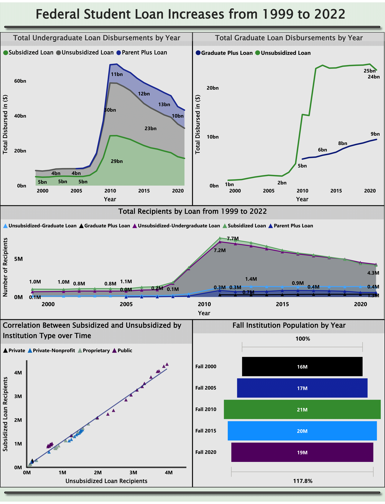

# Financial Aid Analysis Over 20 Years
This project extracts and analyzes financial aid loan/grant increases over time. Below, one will find all relevant information pertaining to the project:

### Data Sources

Data for this project was pulled from the following two websites:

* Studentaid.gov - [Title IV Program Volume Reports](https://studentaid.gov/data-center/student/title-iv#award-year-summaries)

* National Ceneter for Education Statistics - [Fall Enrollment](https://nces.ed.gov/ipeds/SummaryTables/report/201?templateId=2010&years=2021,2020,2019,2018,2017,2016,2015,2014,2013,2012,2011,2010,2009,2008,2007,2006,2005,2004,2003,2002,2001,2000,1999&tt=institutional&instType=1&sid=a3bc80bc-b5a3-4934-974e-3b814cc0e2d1)

### Technologies

* Python
* SQL (DDL and DML)
* Pandas, Numpy
* Power BI
* Power Query
* Azure Data Studio
* VS Code
* Docker

### Methods

This project’s purpose is to see how drastic Title IV funding has increased over the last 20 years.
On the Studentaid.gov website, over 40 excel files were downloaded to obtain the raw data needed.

From there, Python code was used to extract all relevant sheets and information from the files, to then be concatenated into a data frame for loans and grants respectively. 

After, the datasets were then imported to a SQL Server database where they underwent normalization. 

From there, the database was imported into PowerBI to create visualizations.

### Entity Relationship Diagram for SQL Database 

### PowerBI Dashboard 

### Conclusions/Findings

As with many reports, much more data is needed to draw any conclusive results.
However, within the findings, one can see that around 2010 there was a major hike in recipients of all types of Title IV loans.

Within this timeframe, we can see that Graduate Plus loans were also introduced, which can be indicative of rising education costs being supplemented by higher interest federal loans. 

The population of student enrollments has not increased enough to account for so many new recipients of loans, especially in undergraduate programs.

Here is a helpful article from February 2010 noticing increased education costs expected for the upcoming academic year. [CNN Money](https://money.cnn.com/2010/02/24/news/economy/public_tuition_soars/index.htm)

Again, much more data would be needed to make any definite conclusions, however it is apparent student loan recipients have increased at a substantial rate over the last 13 years.

### More Information

[Eligible Loan Amount for Students](https://studentaid.gov/understand-aid/types/loans/subsidized-unsubsidized)

[Pell Grant Eligibility](https://studentaid.gov/understand-aid/types/grants/pell/calculate-eligibility)

#### Eligible Loan Amounts

| Year               | Dependent total amount                                | Independent total amount                              |
|--------------------|-----------------------------------------------------|-------------------------------------------------------|
| First year         | $5,500 ($3,500 subsidized, $2,000 unsubsidized)       | $9,500 ($3,500 subsidized, $6,000 unsubsidized)       |
| Second year        | $6,500 ($4,500 subsidized, $2,000 unsubsidized)       | $10,500 ($4,500 subsidized, $6,000 unsubsidized)      |
| Third year & beyond| $7,500 ($5,500 subsidized, $2,000 unsubsidized)       | $12,500 ($5,500 subsidized, $7,000 unsubsidized)      |

#### Lifetime Aggragate Limits Undergraduate

* Dependent: $31,000 ($23,000 subsidized, $7,000 unsubsidized)

* Independent: $57,500 ($23,000 subsidized, $34,500 unsubsidized)

#### Graduate and Plus Loans 

* Graduate students are eligible for $20,500 per academic year. 

* The lifetime aggragate limit for graduate students is $138,500

* Grad PLUS Loans: Up to the cost of attendance minus other financial aid received.
* Parent PLUS Loans: Up to the cost of attendance minus other financial aid received.

* The Cost of Attendance is the estimated total expenses a student may incur for tuition, fees, housing, meals, books, transportation, and personal expenses during their enrollment in an educational institution. (This can range from less than $5,000 to over $30,000 a year currently)
